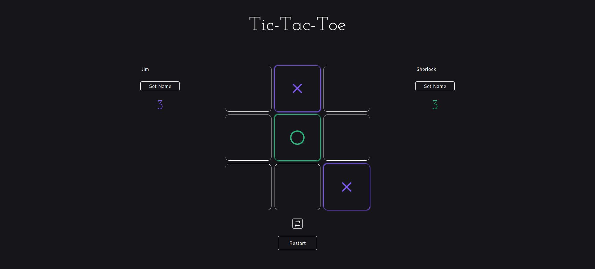

# Tic Tac Toe

Tic-tac-toe, the evergreen boredom buster, developed using HTML, CSS and JavaScript, showcasing the JavaScript **Module Pattern**.

**Check it out :point_right:[here](https://mell62.github.io/tic-tac-toe):point_left:!**

## :thumbsup: Features

- Play the basic tic-tac-toe game by clicking on the grid
- Set/change your names by clicking the "Set Name" button
- Displays the player's name after winning a round, otherwise displays a game draw message
- Restart the game for another round by clicking the "Restart" button

## :star2: Achievements

- The **module pattern** in JavaScript is used to implement the working of this application
- Separation of concerns is implemented: the game logic and the game UI is separated into different modules
- The players are stored as objects using **factory functions**
- The application is developed with the goal of minimizing global code as much as possible
- The concept of **scope** and **closure** is greatly utilized
- Fairly responsive in most devices

## :electric_plug: Extra features

- Displays the score of both players
- Switch players: Players can switch their token after a round by clicking the switch players button just below the tic-tac-toe grid
- The tic-tac-toe grid gives a visual indicator of how the player won the round

## :grey_exclamation: Limitations

- Computer player not implemented

## :page_with_curl: Note

- The CSS preprocessor SASS is used for styling the entire web page
- Modern-normalize is used to maintain cross-browser consistency
